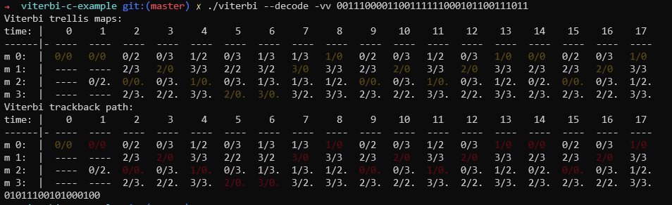
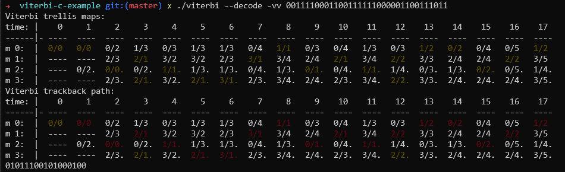
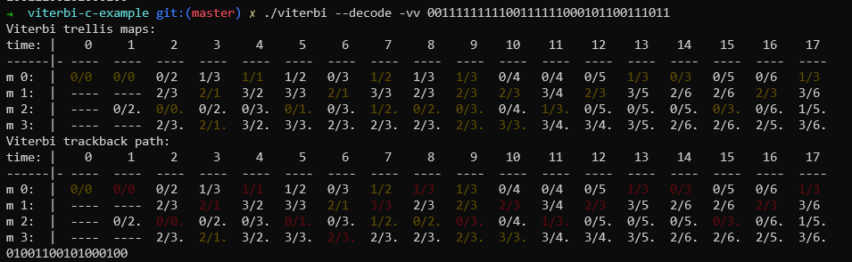

viterbi example in C
====================

对 viterbi 编解码详细的介绍可以参考:
https://zlearning.netlify.app/communication/ecc/eccviterbi
本文是按照其介绍, 使用 C 语言编写的实现代码.

# 卷积编码

卷积编码的实现比较简单, 是通过硬件电路创建的一个状态机, 状态机的内部寄存器我在代码中
称之为 `memory state` 简称为 `m`. 当前时刻卷积输出的结果会受上一状态`m`的影响.

例如`01011100101000100`比特流数据经过卷积之后, 会生成两倍长度的数据.

```console
$ ./viterbi --encode 01011100101000100
0011100001100111111000101100111011
```

# 正常情况下解码

通过代码绘制了两张图, 横轴表示的时间, 每一个单位时间内输入1bit的数据. 纵轴表示状态机
的`memory state`. 每一个小格子中会有 `0/2` 这样的数字标记, 第一个数字 `0` 表示
上一个时间点的`memory state`, 第二个数字 `2` 表示当前路径的度量值, 数字越小表示路径
越优.

在 `0/2` 后面可能还会有一个 `.`, 例如 `0/2.` 表示当前格子的比特数字是 1. 同样不带点
的表示当前格子的数据是 0.



上面有两个表格, 第一个表格显示的是路径的度量值列表, 黄色的数字表示当前列最优的. 第二个
表格是从终点进行回溯产生的路径, 用红色表示. 通过回溯的路径可以将对应的比特解码出来.

# 误码情况下解码

假设当前的物理信道传输不可靠, 接收端的输入发生了误码, 来查看下 Viterbi 解码是如何处理
误码数据的.



可以看到数据在 `time=3` 和 `time=12` 两个时间点下产生了两个最优路径(第一个表格黄色
标记). 当我们从终点回溯的时候, 在 `time=13` 的时候可以看到路径是由 `time=12` 期间
`m=1` 过来的, 这样就去除 `time=12` 的干扰.

经过倒序回溯之后, 看第二个图表中红色的标记, 回溯路径正确, 误码数据都被纠正.

# 连续比特错误

假设在 `time=3` 的时间发生了干扰, 连续几个比特变成1:

```
time:    1  2  3  4  5  6  7  8  9 10 11 12 13 14 15 15 16
原始    00 11 10 00 01 10 01 11 11 10 00 10 11 00 11 10 11
接收    00 11 11 11 11 10 01 11 11 10 00 10 11 00 11 10 11
```



这种卷积编码的方法, 解码时后续的数据会依赖前面的数据. 连续出现的比特错误将会打断这个
依赖, 导致解码错误.

因此一般情况下, 卷积编码之后会按照一个映射关系, 对数据进行乱序处理, 误码发生在乱序之后
的比特流中, 会尽可能的降低连续比特错误的概率.
